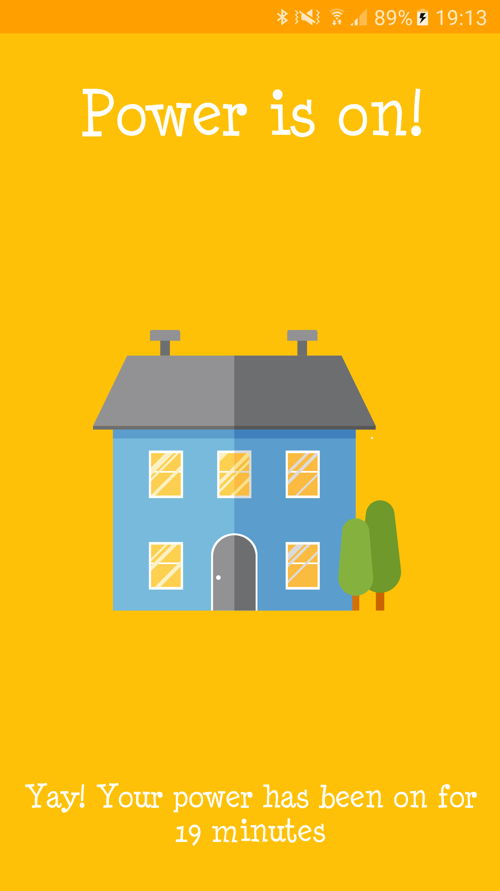
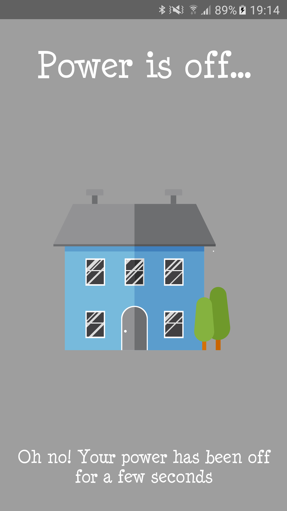

# Electricity Monitor

For those who may not know, I live in South Africa. A country that has been battling power problems for a few years. 
Hey we even have apps that give out "load-shedding" schedules. 

While this is fine and occasionally works when the schedules are actually uploaded, we have a lot of 
"unplanned" power outages that can go on for hours (sometimes even days).

Which leaves me asking myself the following questions:
1. Do I have power at home right now?
2. If not, how long has the power been out for?
3. Is it okay to eat the contents of my freezer? Or should I not risk it?

## introducing "electricity monitor" ##

So you could probably monitor your power remotely in various different ways, 
but I decided to use a Raspberry Pi 3 running Android Things and Firebase Realtime Database to achieve this.

Mainly because there is a *VERY* powerful method for monitoring if a client is connected to your Realtime database or not.

So this app works in the following way:
1. Run the "app" project to a Raspberry Pi 3. Make sure the Raspberry Pi is connected to the internet.
2. Run the "companion-app" on your every day device. 
3. If you have power, you should see a house with lights on and the accumulated time you have had power for. 

4. If you don't have power, the Raspberry Pi will lose its power source and trigger the onDisconnected() callbacks on the Firebase server,
this will then show up in our "companion-app" and the lights in the house will go off. 

It will then also display information about how long the electricity has been off for. 
Cool right?

## Setup Requirements
Before running the app, you need to 
1. Create a Firebase Project, 
2. Download the google-service.json file to both the app folder and the companion-app folder
3. Deploy "app" to the Raspberry Pi or equivalent Android Things device.
4. Deploy "companion-app" to your phone. 

## Yes I know...
- There are easier ways to monitor your power at home
