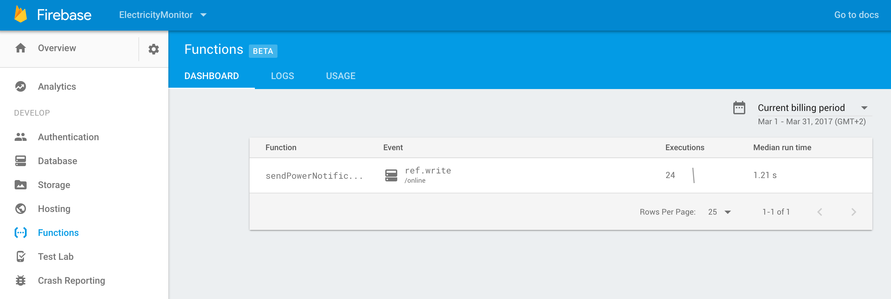

# Electricity Monitor

For those who may not know, I live in South Africa, a country where we sometimes battle with electricity.  
Hey we even have a multitude of apps that give out ["load-shedding"](http://loadshedding.eskom.co.za/loadshedding/description) schedules. See [here](https://play.google.com/store/apps/details?id=com.ashwhale.sepush.eskom&hl=en) and [here](https://play.google.com/store/apps/details?id=com.news24.loadshedding&hl=en). 

While these apps serve a purpose, they are not so good when we have unplanned outages. 

Which often leaves me asking myself the following questions:

- Do I have power at home right now?
- If not, how long has the power been out for?
- Is it okay to eat the contents of my freezer? 

## Introducing "Electricity Monitor"... ##

I decided to use a Raspberry Pi 3 running Android Things and Firebase Realtime Database to monitor the electricity in my house. 

Mainly because Firebase has a *VERY* powerful tool for monitoring if a client is connected to your Realtime database or not. By leveraging the `onDisconnect()` method on the Firebase Realtime database, the server can automatically change some data (or log a time) when a client disconnects.  

## Setup Requirements

In order to get the app running yourself, you need to:

1. Checkout this repository.
2. Create a new Firebase Project [here](https://firebase.google.com).
3. Download the *google-service.json* file from the Firebase Console to both the app folder and the companion-app folder.
4. Set the Realtime database rules to be read and write for everyone (Firebase Console -> Database -> Rules). (WARNING: This means there is NO security on our database – you should not have these rules in production)

	    {
	     "rules": {
	         ".read": true,
	         ".write": true
	       }
	    }

5. Deploy the “app” module to the Raspberry Pi or equivalent Android Things device (you need to make sure you have setup your Pi with the Android Things OS).
6. Deploy the “companion-app” module to your phone.
7. If you have electricity, you will see a house with lights on and the accumulated time you have had power for. If you don’t have electricity, the Raspberry Pi will lose its power source and trigger the `onDisconnect()`  callback on the Firebase server. This will then show up in our “companion-app” , it will display how long the electricity has been off for.

## Push Notification setup using Firebase Cloud Functions
If you want to enable notifications for when your power goes off and on, you can follow the below guide. 
By leveraging [Firebase Cloud Functions](https://firebase.google.com/docs/functions/get-started), we are able to easily send push notifications to any device with the companion-app installed 
to notify them when the power has been cut. 

1. Make sure you have NodeJS and NPM installed. You can follow the guide [here](https://nodejs.org/) to install it.
2. Install Firebase CLI tools:

	    npm install -g firebase-tools

3. Initialize the required dependencies by navigating into the `cloud-functions` folder: 

    	cd cloud-functions
    	npm install 

4. Login with Firebase (this will prompt you to login via Browser):

	    firebase login

5. Run the following command to deploy the Firebase functions:

	    firebase deploy --only functions

6. You should then be able to see the functions appear in the Firebase Console as seen below:

## Yes I know...
- There are easier ways to monitor your power at home
- This is basically monitoring my Pi's connection to the internet and not power, which in most cases will be accurate enough for me as I am hardly without internet. (I guess this could be rebranded as - "Do I have Internet at home?") 
- Yes there is *no* security on the database right now, luckily its not controlling my power. (pull requests are welcome :bowtie:) 
- This should probably be moved into a background service so it can run in the background. 
- You might not understand the need for this app, which is okay, it is useful for me and hopefully fellow South Africans :smile:

## References

- Building an Online Presence System using Firebase Realtime Database - https://firebase.googleblog.com/2013/06/how-to-build-presence-system.html
- Android Things Setup - https://developer.android.com/things/index.html
- Illustration from Vecteezy - https://www.vecteezy.com/vector-art/110154-vector-houses
